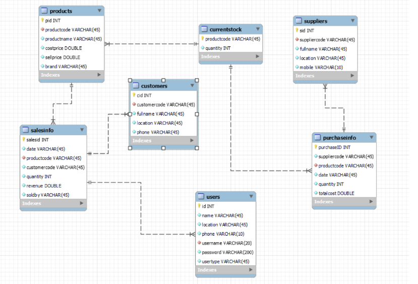

<h3 align="center">Inventory_Management_System</h3>

## Project Description
A Java-based application designed to streamline the management of inventory. It allows users to track products, monitor inventory levels, and manage suppliers. The system aims to improve operational efficiency by automating inventory-related tasks and providing real-time insights into inventory levels. Built using Java Swing, the application integrates with a MySQL database to store product details, transactions, and other essential data.

## Dependencies

1. **FlatLaf**
   - `flatlaf-1.3.jar`
   - `flatlaf-intellij-themes-1.3.jar`

2. **MySQL Connector**
   - `mysql-connector-java-8.0.25.jar`

3. **JUnit**
   - `junit-4.6.jar`

4. **JGoodies**
   - `jgoodies-looks-2.4.1.jar`
   - `jgoodies-common-1.2.0.jar`

5. **JCalendar**
   - `jcalendar-1.4.jar`

## Class Diagram

  

## Project Architechture

  

---

### Developed for IT 320 Object Oriented Programming course in collaboration with [Ilyes Ben Khalifa](https://www.linkedin.com/in/ilyes-ben-khalifa-112045221/)

---

<h3 align="left">Connect with me:</h3>

